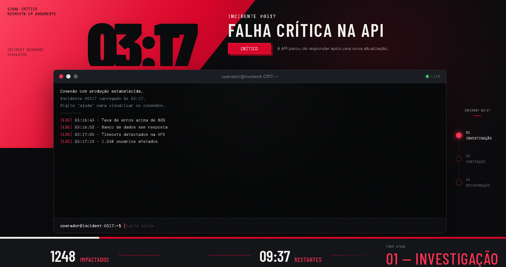

<div align="center">

# INCIDENT 03:17 

### Simulador de resposta a incidentes em produção

Investigue falhas, encontre pistas e tome decisões antes que o sistema saia de controle.


<br>



<br>

</div>

---

## Sobre o projeto

O **Incident 03:17** é um simulador interativo de resposta a incidentes inspirado em situações reais enfrentadas por equipes de desenvolvimento, infraestrutura e SRE.

O jogador assume o papel de um operador responsável por investigar uma falha em produção. Todas as decisões são executadas por comandos dentro de um terminal.

Cada ação pode:

- Revelar novas pistas;
- Desbloquear comandos;
- Consumir tempo;
- Alterar a pontuação;
- Aumentar ou reduzir o impacto;
- Levar a diferentes finais.

O objetivo não é apenas encontrar o comando correto, mas entender o problema e executar as ações na ordem adequada.

---

## Como funciona

A partida passa por quatro possíveis fases:

```text
INVESTIGAÇÃO → CONTENÇÃO → RECUPERAÇÃO → ENCERRADO
```

No início, apenas comandos básicos estão disponíveis.

Ao analisar logs, métricas e serviços, o jogador encontra pistas. Essas pistas liberam novas possibilidades de investigação e recuperação.

Decisões precipitadas podem agravar o incidente, enquanto uma investigação bem conduzida reduz o impacto sobre os usuários.

---

## Cenários disponíveis

### Incidente 03:17 — Falha crítica na API

Uma atualização recente fez a API parar de responder. O banco de dados está sobrecarregado e milhares de usuários foram afetados.

O jogador precisa investigar o deploy, analisar as conexões e decidir entre contenção, rollback ou aplicação de um hotfix.

### Incidente 02:41 — Ataque distribuído à autenticação

O serviço de autenticação começou a receber um volume anormal de requisições.

O jogador precisa identificar o padrão do tráfego, diferenciar usuários legítimos de requisições maliciosas e conter o ataque sem bloquear completamente o sistema.

Ao reiniciar a partida, o sistema seleciona outro cenário sem repetir imediatamente o incidente anterior.

---

## Terminal interativo

As decisões são digitadas diretamente no terminal da interface.

Alguns comandos gerais:

```text
ajuda
status
reiniciar
```

Exemplos de comandos de investigação:

```text
logs
metricas
analisar banco
analisar deploy
inspecionar conexoes
```

Os comandos disponíveis mudam durante a partida. Digite `ajuda` para visualizar apenas as ações liberadas naquele momento.

O terminal também possui:

- Histórico acessível pelas setas ↑ e ↓;
- Rolagem automática para a última resposta;
- Contador visual de tempo;
- Registro completo das decisões;
- Mensagens de comandos bloqueados ou inválidos.

---

## Sistema de decisões

Cada ação possui regras próprias:

- Requisitos necessários;
- Tempo consumido;
- Pontos ganhos ou perdidos;
- Alteração no número de usuários afetados;
- Pista que pode ser encontrada;
- Possibilidade de vitória ou derrota.

Por exemplo, executar um rollback após confirmar a origem da falha pode resolver o incidente. Fazer o mesmo sem informações suficientes pode ampliar o impacto.

Isso permite que uma mesma situação tenha resultados diferentes dependendo da estratégia utilizada.

---

## Principais funcionalidades

- Interface inspirada em uma central de incidentes;
- Terminal totalmente interativo;
- Múltiplos cenários;
- Sistema de pistas e comandos desbloqueáveis;
- Fases de investigação, contenção e recuperação;
- Pontuação dinâmica;
- Contagem de usuários afetados;
- Limite de tempo;
- Histórico de comandos;
- Diferentes caminhos para vitória e derrota;
- Reinício com alternância de cenário;
- Estado da partida armazenado na sessão;
- Layout responsivo;
- Animações e efeitos visuais;
- Testes automatizados com Pytest.

---

## Tecnologias utilizadas

### Back-end

- Python
- Flask
- Jinja2
- Flask Session

### Front-end

- HTML5
- CSS3
- JavaScript

---

## Estrutura do projeto

```text
incident-0317/
│
├── static/
│   ├── css/
│   │   └── style.css
│   │
│   └── js/
│       └── game.js
│
├── templates/
│   └── index.html
│
├── tests/
│   └── test_game.py
│
├── app.py
├── game.py
├── incidentes.py
├── requirements.txt
├── .env.example
├── .gitignore
└── README.md
```

### Responsabilidade dos arquivos

- `app.py`: rotas, sessão e comunicação entre a interface e o jogo;
- `game.py`: regras, comandos, pontuação, pistas e processamento das ações;
- `incidentes.py`: informações e ações específicas de cada cenário;
- `index.html`: estrutura visual e integração com o Jinja;
- `style.css`: identidade visual e responsividade;
- `game.js`: histórico do terminal, animações, foco e contador;
- `test_game.py`: testes das regras e dos diferentes caminhos do jogo.

---

## Como executar

### 1. Clone o repositório

```bash
git clone https://github.com/DutraBrun0/incident-0317.git
cd incident-0317
```

### 2. Crie o ambiente virtual

```bash
python -m venv .venv
```

### 3. Ative o ambiente virtual

No Windows:

```bash
.venv\Scripts\activate
```

No Linux ou macOS:

```bash
source .venv/bin/activate
```

### 4. Instale as dependências

```bash
pip install -r requirements.txt
```

### 5. Configure as variáveis de ambiente

No Windows:

```bash
copy .env.example .env
```

No Linux ou macOS:

```bash
cp .env.example .env
```

Depois, abra o arquivo `.env` e configure os valores necessários.

### 6. Inicie a aplicação

```bash
python app.py
```

Acesse no navegador:

```text
http://127.0.0.1:5000
```

---

## Testes automatizados

Para executar os testes:

```bash
pytest -v
```

A suíte atual possui **21 testes**, incluindo:

- Carregamento dos incidentes;
- Criação do estado inicial;
- Interpretação de comandos;
- Bloqueio de ações sem requisitos;
- Desbloqueio de comandos por pistas;
- Penalidade por decisões incorretas;
- Vitória e derrota nos dois cenários;
- Encerramento por tempo esgotado;
- Alternância entre incidentes.

---

## Próximas melhorias

- Adicionar novos cenários;
- Criar níveis de dificuldade;
- Adicionar ranking local;
- Gerar relatório final da partida;
- Salvar estatísticas do jogador;
- Adicionar sons opcionais;
- Criar conquistas;
- Disponibilizar o projeto online.

---

## Objetivo

Este projeto foi desenvolvido para praticar:

- Organização de regras de negócio;
- Desenvolvimento com Flask;
- Manipulação de sessões;
- Integração entre Python e JavaScript;
- Testes automatizados;
- Construção de interfaces responsivas;
- Modelagem de diferentes estados e resultados.

Além da parte técnica, o projeto apresenta conceitos usados em operações reais, como observabilidade, contenção, rollback, análise de métricas e recuperação de serviços.

---

## Autor

Desenvolvido por **Bruno Dutra**.

[GitHub](https://github.com/DutraBrun0) • [LinkedIn](https://www.linkedin.com/in/brunodutraaa/)

---

<div align="center">

**03:17 — o sistema caiu. Cada decisão importa.**

</div>
